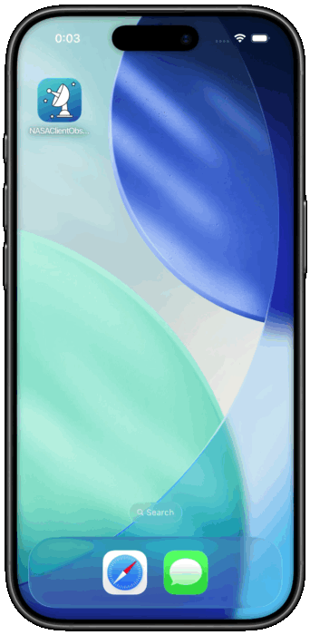
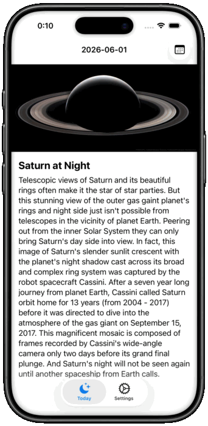

# NASA Client iOS (Observation framework version)

## Overview

- An iOS app for browsing NASA's Astronomy Picture of the Day (APOD)
- About the API
  - Official website: https://api.nasa.gov/
  - GitHub repo: https://github.com/nasa/apod-api

## Features

### Browsing Astronomy Picture of the Day (APOD)

| Today's APOD | Specific date |
| - | - |
|  |  |

### Accesibility Support

- Light / Dark mode
- Dynamic Type
- Localization (EN, JA)

## Getting Started

1. Clone the repo
2. Open `NASAClientObservationVer.xcodeproj`
3. Choose `NASAClientObservationVer` scheme
4. Run the app

## Architecture

- A Multi-Module Architecture utilizing Swift Package Manager (SPM)
- The codebase is divided into a main application target and a local Swift Package named `Features`
- MVVM using [the Observation frameworks](https://developer.apple.com/documentation/observation)
- External dependency management using [swift-dependencies](https://github.com/pointfreeco/swift-dependencies)

### Module Descriptions

| Layer | Module / Target | Description |
| :--- | :--- | :--- |
| Application | `NASAClientObservationVerApp` | The main iOS application target. |
| Features | `AppFeature` | Orchestrates the root navigation and combines different features (APOD, Settings). |
| | `FeatureAstronomyPictureDetail` | Displays the Astronomy Picture of the Day (APOD) details and handles its interactive UI. |
| | `FeatureSettings` | Manages app settings, API key configurations, and license displays. |
| Core / Infrastructure | `APIClient` | API client interface and its live implementation, built with Point-Free's `swift-dependencies` framework. |
| | `APIKeyClient` | Secure API key management interface and its live implementation backed by `KeychainAccess`. |
| | `Models` | Common data models (e.g., APOD models) used across various features. |
| | `SharedKeys` | Global configuration and shared keys utilizing Point-Free's `swift-sharing` framework. |
| | `SharedUI` | Reusable UI components. |

## Environment

```
❯ xcodebuild -version
Xcode 26.5
Build version 17F42
```

```
❯ swift --version
swift-driver version: 1.148.6 Apple Swift version 6.3.2 (swiftlang-6.3.2.1.108 clang-2100.1.1.101)
Target: arm64-apple-macosx26.0
```
